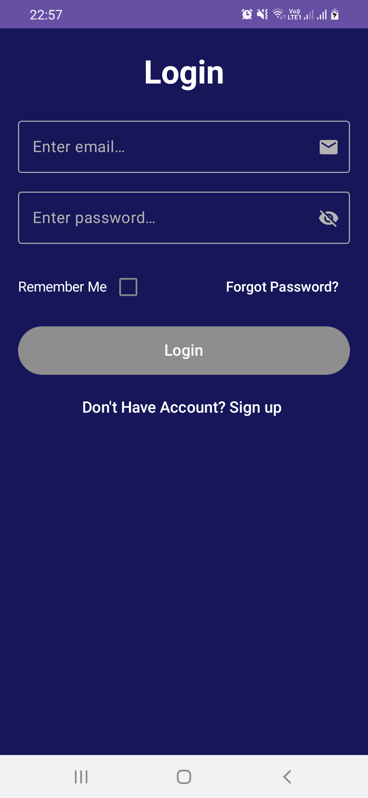
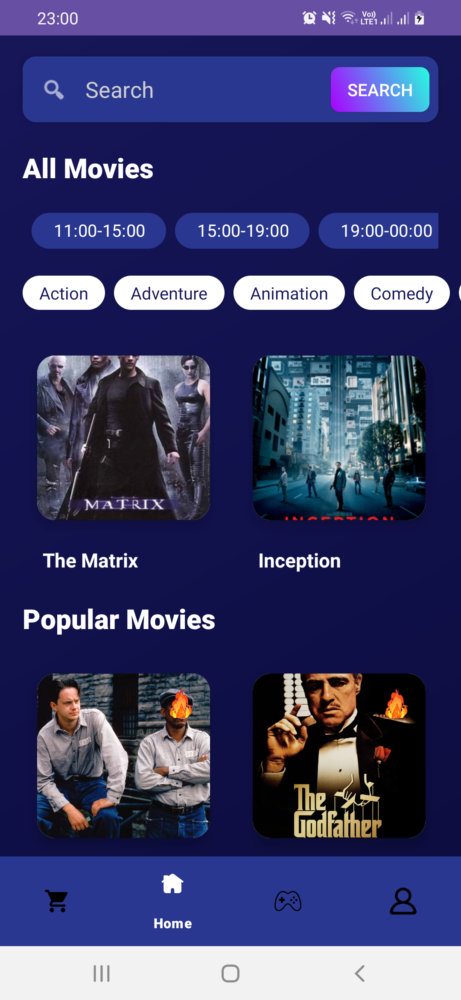
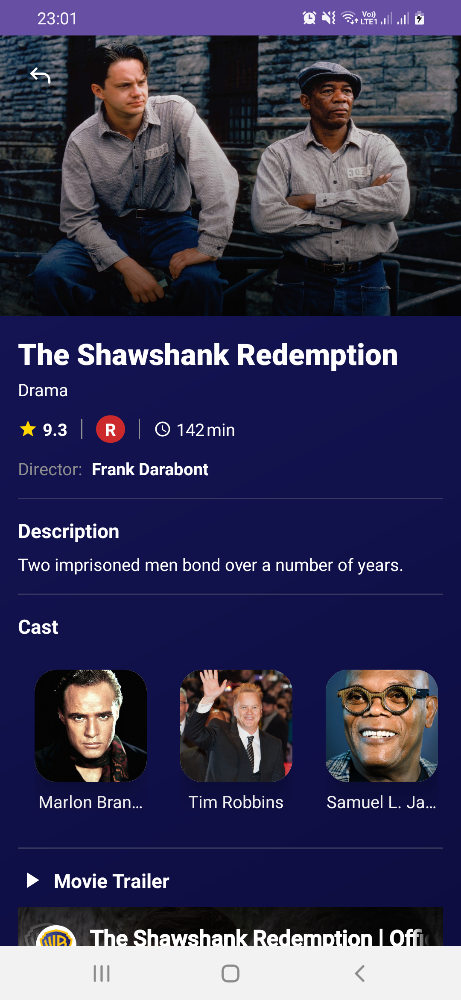
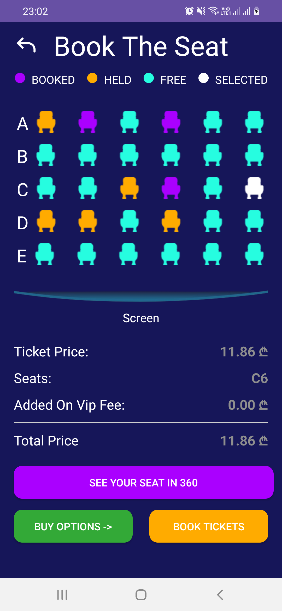
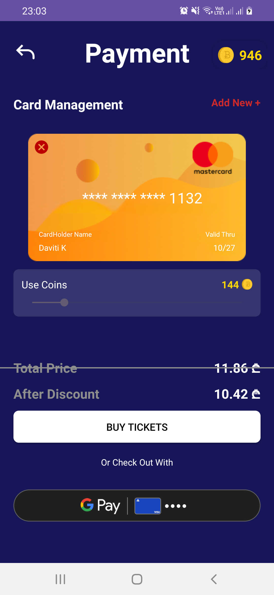
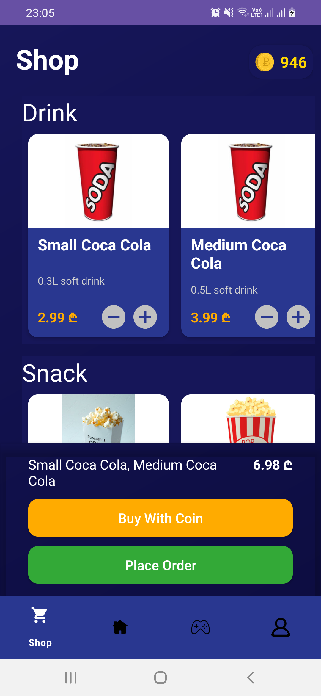
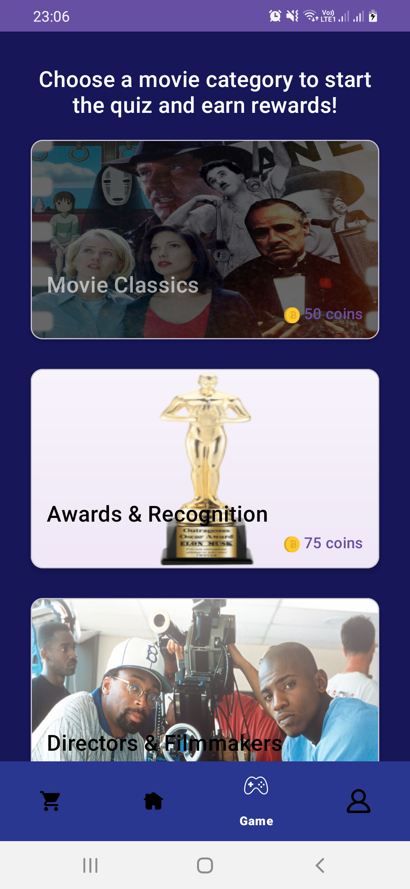
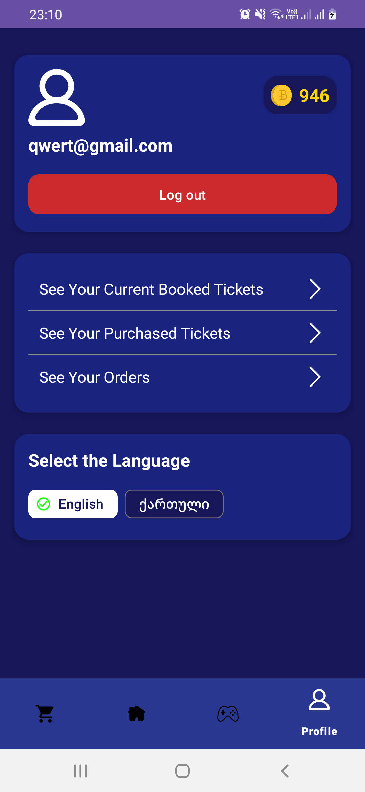

# Custom Movie Theatre Application

This repository contains the final project for TBC Academy’s IT track: a Custom Movie Theatre Android app.  
Users can browse now-showing and upcoming movies, book or buy tickets, preview seats in 360°, pay in-app (custom gateway or Google Pay), and earn or spend coins on tickets and snacks via mini-games.  

---

## 📋 Table of Contents

- [🚀 Features](#-features)  
- [🖼️ Screenshots](#️-screenshots)  
- [🧰 Tech Stack](#-tech-stack)  
- [🏗 Architecture](#-architecture)  
- [🛠 Getting Started](#-getting-started)  
- [🌐 Localization](#-localization)  
- [🤝 Contributing](#-contributing)  
- [📄 License](#-license)  

---

## 🚀 Features

- **Movie Listings**:  
  - Now Showing & Upcoming movies; search by title or genre.  
- **Ticket Management**:  
  - Book or buy tickets; cancel bookings; view history.  
- **360° Seat View**:  
  - Preview theatre layout in panorama before selecting seats.  
- **In-App Payments**:  
  - Custom gateway, Google Pay, or in-app digital coins.  
- **Coin System**:  
  - Earn coins via quizzes and games; redeem for tickets or snacks.  
- **Snack Shop**:  
  - Order snacks; pay by card, Google Pay, or coins; track orders.  
- **Authentication**:  
  - Firebase Email/Password & Google sign-in; online-only access.  
- **Mini-Games**:  
  - Quizzes and casual games to earn coins.  
- **Bilingual Support**:  
  - English and Georgian interfaces.  

---

## 🖼️ Screenshots

<div style="display: flex; flex-wrap: wrap; gap: 10px;">
  
  
  
  
  
  
  
  
</div>

---

## 🧰 Tech Stack

- **Android**: Kotlin, XML & Jetpack Compose  
- **Architecture**: Clean Architecture, MVI, SOLID Principles  
- **Networking**: Retrofit, OkHttp Logger Interceptor  
- **Image Loading**: Glide  
- **Navigation**: Jetpack Navigation Component & Safe Args  
- **Dependency Injection**: Dagger-Hilt  
- **Serialization**: Kotlinx Serialization  
- **Concurrency**: Coroutines & Flow  
- **Data Storage**: Proto DataStore, Preferences DataStore  
- **Backend & Auth**: Firebase Auth, Firestore, Kotlin Spring Boot  

---

## 🏗 Architecture

We use a **modularized hybrid strategy** with three layers:  
1. **Domain Layer**: Business logic, use cases, repository interfaces.  
2. **Data Layer**: Repository implementations, network services, local data sources.  
3. **Presentation Layer**: UI with MVI (Model-View-Intent), Jetpack Compose/XML.  

This separation ensures testability, maintainability, and scalability.

---


### Installation

1. **Clone the repository**  
   ```bash
   git clone https://github.com/SabaDogonadze/Movie_Theatre.git
   cd Movie_Theatre
